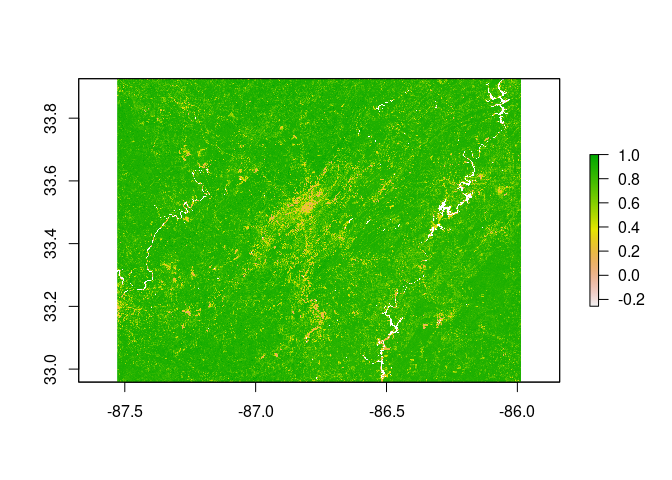
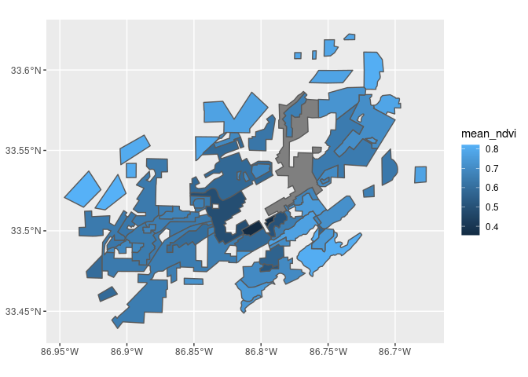
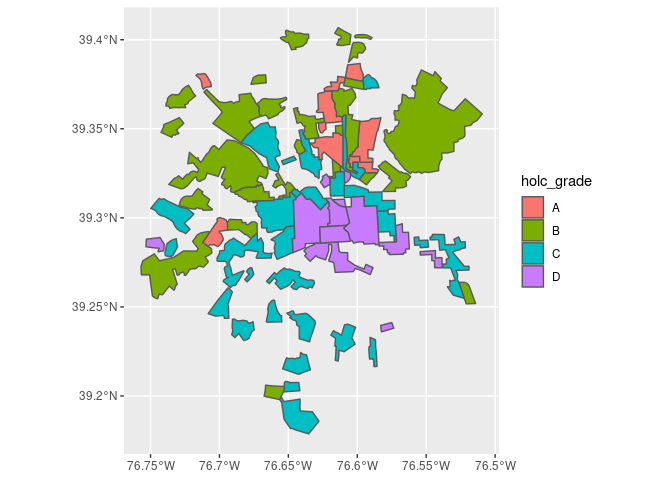
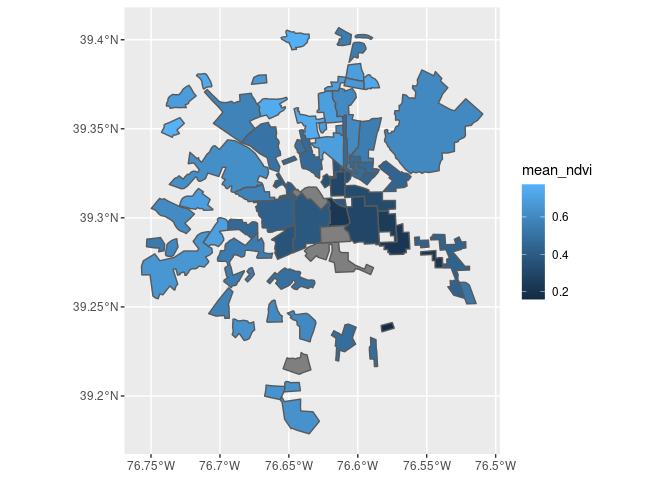
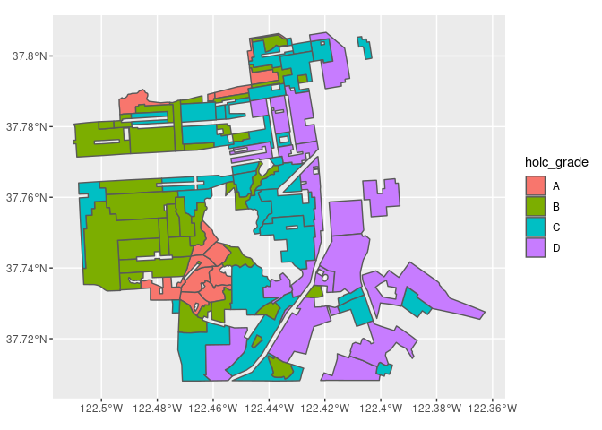
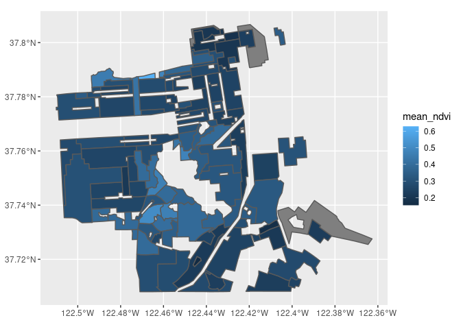
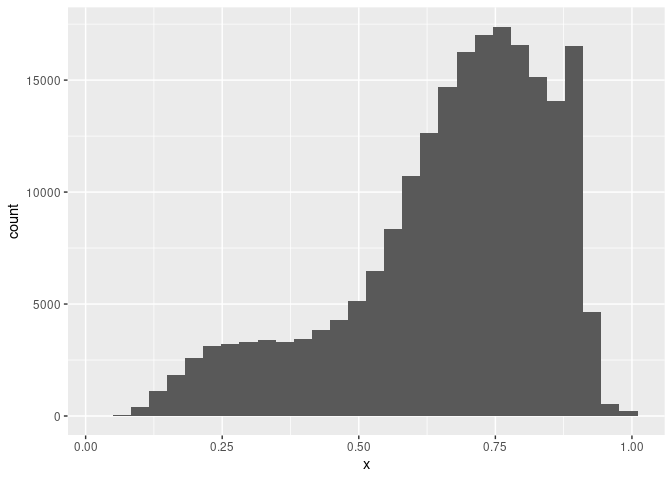
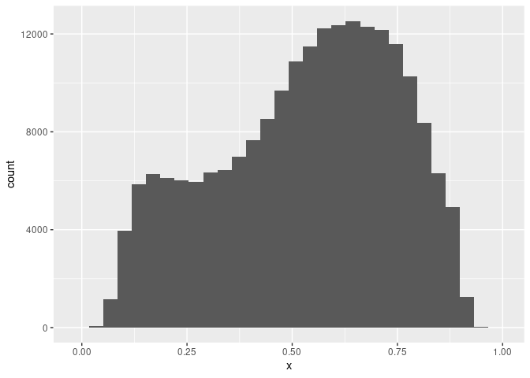
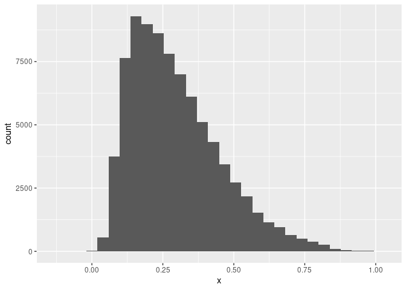

The ecological and evolutionary consequences of systemic racism
================
Joslyn Fu & Kelly Yuan

# Objectives

We empirically explore why systematic and structural racism is
interwined with urban ecological processes by investigating three
cities: Birmingham, Baltimore and San Francisco.

# Background Information

In August 2020, [Christopher
Schell](http://directory.tacoma.uw.edu/employee/cjschell) and collegues
published a review in *Science* on [‘The ecological and evolutionary
consequences of systemic racism in urban
environments’](https://science.sciencemag.org/content/early/2020/08/12/science.aay4497)
(DOI: 10.1126/science.aay4497), showing how systematic racism and
classism has significant impacts on ecologial and evolutionary processes
within urban environments. Here we explore a subset of the data used to
support these findings in this review and the broaded literature. We are
going to explore one metric for how structural racism and classism
underpin landscape heterogeneity in cities.

**Figure** in the Schell paper shows how NDVI (Normalized Difference
Vegetation Index) tracks historical redlining. 

We are going to recreate these city maps, and plot the distributions and
mean vegetation patterns across cities to explore the structural
inequality and racism that Schell et al highlight in their paper.

To do this we are going to use the following spatial data:

**1.Mapping Inequality:** (vector data)

**2.Normalized Difference Vegetation Index (NDVI)** (raster data) NDVI
is used as proxy measure of vegetation health, cover and phenology (life
cycle stage) over large areas. It is calculated using multiple bands
from satellite images.

We first load the data.

``` r
tmp <- tempfile()
download.file("https://dsl.richmond.edu/panorama/redlining/static/fullshpfile.zip", tmp)
unzip(tmp)
```

Read in RedLining Data.

``` r
holc <- st_read("fullshpfile/shapefile/holc_ad_data.shp")
```

    ## Reading layer `holc_ad_data' from data source `/home/runner/_work/geospatial-yuan-fu/geospatial-yuan-fu/assignment/fullshpfile/shapefile/holc_ad_data.shp' using driver `ESRI Shapefile'
    ## Simple feature collection with 8878 features and 7 fields (with 3 geometries empty)
    ## geometry type:  MULTIPOLYGON
    ## dimension:      XY
    ## bbox:           xmin: -122.7675 ymin: 25.70537 xmax: -70.9492 ymax: 47.72251
    ## geographic CRS: WGS 84

# Birmingham

We begin our analysis by plotting the redlining grade and mean NDVI of
Brimingham.

``` r
holc_birmingham <- holc %>% filter(city == "Birmingham")
```

``` r
ndvi_birmingham <- raster("../data/NDVI/composite_birmingham.tif")
```

``` r
shp_birmingham <- holc %>% filter(city == "Birmingham")
shp_birmingham %>% ggplot() + geom_sf(aes(fill = holc_grade))
```

<!-- -->

``` r
shp_birmingham2 <- shp_birmingham %>% 
  dplyr::mutate(mean_ndvi = raster::extract(ndvi_birmingham, shp_birmingham, fun = mean))

shp_birmingham2
```

    ## # A tibble: 60 x 9
    ##    state city  name  holc_id holc_grade neighborho area_descr
    ##    <chr> <chr> <chr> <chr>   <chr>           <int> <chr>     
    ##  1 AL    Birm… Moun… A1      A                 244 "{ \"1c\"…
    ##  2 AL    Birm… Redm… A2      A                 193 "{ \"3n\"…
    ##  3 AL    Birm… Colo… A3      A                 206 "{ \"2c\"…
    ##  4 AL    Birm… Grov… B1      B                 203 "{ \"1c\"…
    ##  5 AL    Birm… Best… B10     B                 189 "{ \"5\" …
    ##  6 AL    Birm… Coll… B11     B                 219 "{ \"4b\"…
    ##  7 AL    Birm… Fair… B12     B                 227 "{ \"2a\"…
    ##  8 AL    Birm… Red … B13     B                 202 "{ \"33\"…
    ##  9 AL    Birm… Roeb… B14     B                 187 "{ \"1d\"…
    ## 10 AL    Birm… Bett… B15     B                 194 "{ \"3l\"…
    ## # … with 50 more rows, and 2 more variables: geometry <MULTIPOLYGON [°]>,
    ## #   mean_ndvi[,1] <dbl>

``` r
shp_birmingham2 %>% 
  mutate(mean_ndvi = as.numeric(mean_ndvi)) %>%
  ggplot() + geom_sf(aes(fill = mean_ndvi))
```

<!-- -->

According to the two graphs above, Birmingham is largely dominated by
grade D area. It is very obvious that the only A grade area has a higher
value of mean NDVI.

# Baltimore

``` r
holc_baltimore <- holc %>% filter(city == "Baltimore")
```

``` r
ndvi_baltimore <- raster("../data/NDVI/composite_baltimore.tif")
```

``` r
shp_baltimore <- holc_baltimore %>% 
   dplyr::mutate(mean_ndvi = raster::extract(ndvi_baltimore, holc_baltimore, fun = mean))
```

``` r
shp_baltimore %>% ggplot() + geom_sf(aes(fill = holc_grade))
```

<!-- -->

``` r
shp_baltimore %>% 
  mutate(mean_ndvi = as.numeric(mean_ndvi)) %>%
  ggplot() + geom_sf(aes(fill = mean_ndvi))
```

<!-- -->
According to the two graphs above, the areas with low NDVI value largely
concentrate in the grade D area and grade C area. We can see a very
similar color pattern in the two map. The blue color is gradually
becoming lighter when shifting away from the center: this follows the
redlining grade (A and B in the outer city).

# San Francisco

``` r
holc_sf <- holc %>% filter(city == "San Francisco")
```

``` r
ndvi_sf <- raster("../data/NDVI/composite_SF.tif")
```

``` r
shp_sf <- holc_sf %>% 
   dplyr::mutate(mean_ndvi = raster::extract(ndvi_sf, holc_sf, fun = mean))
```

``` r
shp_sf %>% ggplot() + geom_sf(aes(fill = holc_grade))
```

<!-- -->

``` r
shp_sf %>% 
  mutate(mean_ndvi = as.numeric(mean_ndvi)) %>%
  ggplot() + geom_sf(aes(fill = mean_ndvi))
```

<!-- -->
We can see that the areas with an A redlining grade have a lighter blue
in the mean NDVI graph. Places with a D grade have significantly less
value of NDVI.

In the end, we compare the three cities by plotting the distribution of
their mean NDVI value. We intend to investigate how how the trends
differ between cities.

# NDVI Trend

``` r
shp <- shp_birmingham %>%
  dplyr::mutate(pixel_ndvi = raster::extract(ndvi_birmingham, shp_birmingham))
```

``` r
data.frame(x = unlist(shp$pixel_ndvi)) %>% 
  ggplot(aes(x)) + geom_histogram()
```

    ## `stat_bin()` using `bins = 30`. Pick better value with `binwidth`.

    ## Warning: Removed 24 rows containing non-finite values (stat_bin).

<!-- -->

``` r
shp2 <- shp_baltimore %>%
  dplyr::mutate(pixel_ndvi = raster::extract(ndvi_baltimore, shp_baltimore))
```

``` r
data.frame(x = unlist(shp2$pixel_ndvi)) %>% 
  ggplot(aes(x)) + geom_histogram()
```

    ## `stat_bin()` using `bins = 30`. Pick better value with `binwidth`.

    ## Warning: Removed 16 rows containing non-finite values (stat_bin).

<!-- -->

``` r
shp3 <- shp_sf %>%
  dplyr::mutate(pixel_ndvi = raster::extract(ndvi_sf, shp_sf))
```

``` r
data.frame(x = unlist(shp3$pixel_ndvi)) %>% 
  ggplot(aes(x)) + geom_histogram()
```

    ## `stat_bin()` using `bins = 30`. Pick better value with `binwidth`.

    ## Warning: Removed 21 rows containing non-finite values (stat_bin).

<!-- -->

Analysis: Birmingham has a left skewed mean NDVI plot. Most of the NDVI
values are around 0.75. Baltimore has a relatively bell shaped NDVI
histogram plot. Most of the values are around 0.50 - 0.75. San Francisco
has a right skewed mean NDVI plot, with most of the NDVI values around
0.1 - 0.25.

According to the histogram graphs, San Francisco has the lowest NDVI on
average, and Birmingham has the highest.

# Conclusion

As we can see from the previous two analysis, one place is more likely
to have more vegetation covered in the long run if it has a higher HOLC
grade in the beginning, while places with low HOLC grade would continue
to have low vegetation coverage. Thus, considering systematic inequity
and racism is important in the context of global change, and developing
solutions to the biodiversity crisis as a disadvantage in accessing
natural resources would result in laying behind for a long time. For
example, some Oceania countries have low GDP per capita and release
little amount of carbon dioxide, yet they are the first countries face
the crisis of rising sea level. This is the inequity and racism in
global change and we need to address those problems while thinking about
solutions.
