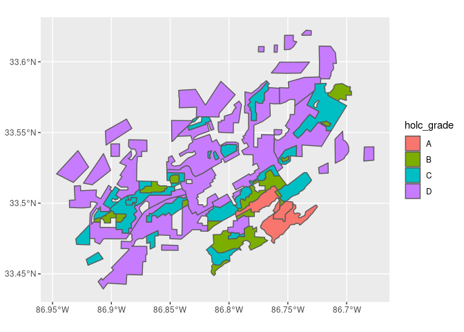
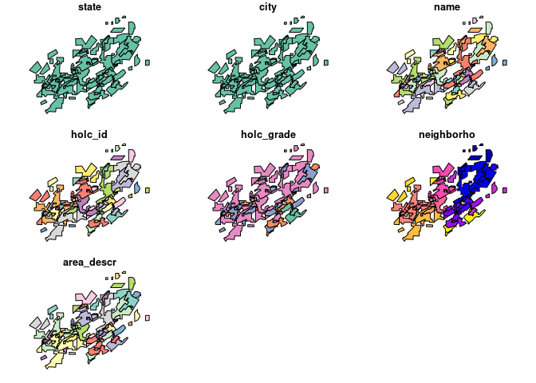

The ecological and evolutionary consequences of systemic racism
================
Millie Chapman (GSI)

## Learning objectives

This module provides an introduction to the fundamentals of working with
spatial vector and raster data in R while empirically exploring why
systematic and structural racism is interwined with urban ecological
processes. This module uses the Simple Features Access standard (ISO
19125) and tidyverse-style workflow using the sf package and emerging
ecosystem of r-spatial tools.

# Exercise

In August 2020, [Christopher
Schell](http://directory.tacoma.uw.edu/employee/cjschell) and collegues
published a review in *Science* on [‘The ecological and evolutionary
consequences of systemic racism in urban
environments’](https://science.sciencemag.org/content/early/2020/08/12/science.aay4497)
(DOI: 10.1126/science.aay4497), showing how systematic racism and
classism has significant impacts on ecologial and evolutionary processes
within urban environments. Here we explore a subset of the data used to
support these findings in this review and the broaded literature.

The [press
release](https://www.washington.edu/news/2020/08/13/systemic-racism-has-consequences-for-all-life-in-cities/)
on the paper is worth a read if you have the time:

> “Racism is destroying our planet, and how we treat each other is
> essentially structural violence against our natural world,” said lead
> author Christopher Schell, an assistant professor of urban ecology at
> the University of Washington Tacoma. “Rather than just changing the
> conversation about how we treat each other, this paper will hopefully
> change the conversation about how we treat the natural world.”

In the paper, Schell writes:

> “In multiple cases, neighborhood racial composition can be a stronger
> predictor of urban socio-ecological patterns than wealth.”

We are going to explore one metric for how structural racism and
classism underpin landscape heterogeneity in cities.

**Figure 2** in the Schell paper shows how NDVI (Normalized Difference
Vegetation Index) tracks historical redlining. 

We are going to recreate these city maps, and plot the distributions and
mean vegetation patterns across cities to explore the structural
inequality and racism that Schell et al highlight in their paper.

To do this we are going to use the following spatial data:

**1.Mapping Inequality:** (vector data)  
Please take the time to read the introduction to this dataset
[here](https://dsl.richmond.edu/panorama/redlining/#loc=3/41.245/-105.469&text=intro)

> “As you explore the materials Mapping Inequality, you will quickly
> encounter exactly that kind of language, descriptions of
> the”infiltration" of what were quite often described as
> “subversive,” “undesirable,” “inharmonious,” or “lower grade”
> populations, for they are everywhere in the HOLC archive ….These
> grades were a tool for redlining: making it difficult or impossible
> for people in certain areas to access mortgage financing and thus
> become homeowners. Redlining directed both public and private capital
> to native-born white families and away from African American and
> immigrant families. As homeownership was arguably the most significant
> means of intergenerational wealth building in the United States in the
> twentieth century, these redlining practices from eight decades ago
> had long-term effects in creating wealth inequalities that we still
> see today. Mapping Inequality, we hope, will allow and encourage you
> to grapple with this history of government policies contributing to
> inequality."

**2.Normalized Difference Vegetation Index (NDVI)** (raster data) NDVI
is used as proxy measure of vegetation health, cover and phenology (life
cycle stage) over large areas. It is calculated using multiple bands
from satellite images.

``` r
tmp <- tempfile()
download.file("https://dsl.richmond.edu/panorama/redlining/static/fullshpfile.zip", tmp)
unzip(tmp)
```

Read in RedLining
    Data

``` r
holc <- st_read("fullshpfile/shapefile/holc_ad_data.shp")
```

    ## Reading layer `holc_ad_data' from data source `/home/rstudio/geospatial-yuan-fu/assignment/fullshpfile/shapefile/holc_ad_data.shp' using driver `ESRI Shapefile'
    ## Simple feature collection with 8878 features and 7 fields (with 3 geometries empty)
    ## geometry type:  MULTIPOLYGON
    ## dimension:      XY
    ## bbox:           xmin: -122.7675 ymin: 25.70537 xmax: -70.9492 ymax: 47.72251
    ## geographic CRS: WGS 84

``` r
holc_brimingham <- holc %>% filter(city == "Brimingham")
```

``` r
ndvi_birmingham <- raster("../data/NDVI/composite_birmingham.tif")
```

``` r
plot(ndvi_birmingham)
```

<!-- -->

``` r
shp_birmingham <- holc %>% filter(city == "Birmingham")
shp_birmingham %>% ggplot() + geom_sf(aes(fill = holc_grade))
```

<!-- -->

``` r
shp <- shp_birmingham %>% 
  dplyr::mutate(mean_ndvi = raster::extract(ndvi_birmingham, shp_birmingham, fun = mean))

shp
```

    ## # A tibble: 60 x 9
    ##    state city  name  holc_id holc_grade neighborho area_descr
    ##    <chr> <chr> <chr> <chr>   <chr>           <int> <chr>     
    ##  1 AL    Birm… Moun… A1      A                 244 "{ \"1c\"…
    ##  2 AL    Birm… Redm… A2      A                 193 "{ \"3n\"…
    ##  3 AL    Birm… Colo… A3      A                 206 "{ \"2c\"…
    ##  4 AL    Birm… Grov… B1      B                 203 "{ \"1c\"…
    ##  5 AL    Birm… Best… B10     B                 189 "{ \"5\" …
    ##  6 AL    Birm… Coll… B11     B                 219 "{ \"4b\"…
    ##  7 AL    Birm… Fair… B12     B                 227 "{ \"2a\"…
    ##  8 AL    Birm… Red … B13     B                 202 "{ \"33\"…
    ##  9 AL    Birm… Roeb… B14     B                 187 "{ \"1d\"…
    ## 10 AL    Birm… Bett… B15     B                 194 "{ \"3l\"…
    ## # … with 50 more rows, and 2 more variables: geometry <MULTIPOLYGON [°]>,
    ## #   mean_ndvi[,1] <dbl>

``` r
plot(shp_birmingham)
```

<!-- -->

# Exercise 1

**Create a map which shows current (2019) mean NDVI across city
redlining from the 1950s.**

# Exercise 2

**Plot the average NDVI values in different neighborhoods as well as the
distribution of pixel values across cities and neighborhoods. Show how
the trends differ between cities.**

# Exercise 3:

**Explain why considering systematic inequity and racism is important in
the context of global change and developing solutions to the
biodiversity crisis.**
